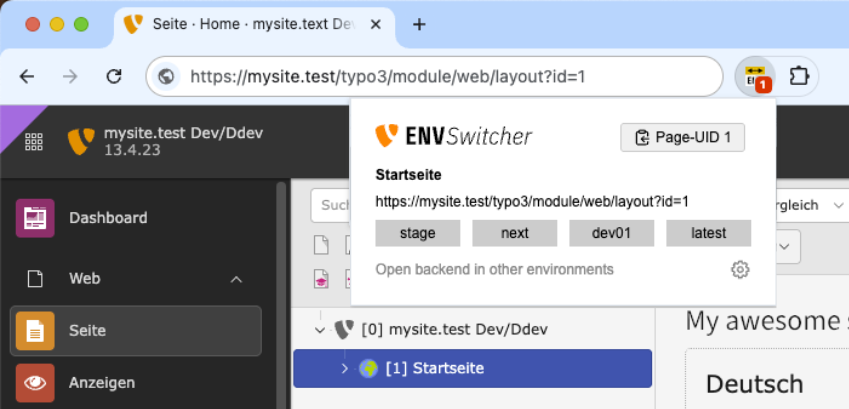

# TYPO3 Environement Switcher

Chrome extension for TYPO3 CMS developers and editors. Streamlines the workflow of switching between multiple environments.

Click the extension icon to open the switcher popup. Copy curent page UID.

### Frontend

| Symbol                            | Description                                                                                                                                      |
| --------------------------------- | ------------------------------------------------------------------------------------------------------------------------------------------------ |
|   | Open the page in the frontend or the List/Page module of another environment. Project environments are detected based on the current page's URL. |
|  | Click the upper-right corner to pin an environment to the right side of the list.                                                                |
|    | Add and enable color badges in the project settings.                                                                                             |

### Backend

### Settings

### Privacy

This extension does not collect or transmit any personal data. All settings are stored locally in your
browser's sync storage.

### Credits

I got inspired by [TYPO3 PID Helper](https://chromewebstore.google.com/detail/typo3-pid-helper/epgcolbkhdbpplgndgmbcdnepgdophob) and [TYPO3 - BE/FE/Env Handy Switcher](https://chromewebstore.google.com/detail/typo3-befeenv-handy-switc/ohemimdlihjdeacgbccdkafckackmcmn). Both gave me a jumpstart, to tinker my own thing together.

| asset      | source                                                 |
| ---------- | ------------------------------------------------------ |
| Icons      | Lucide Icons                                           |
| Fonts      | IBM Plex Mono, Share (TYPO3)                           |
| TYPO3 Logo | The TYPO3 Association is owner of the TYPO3 trademark. |
