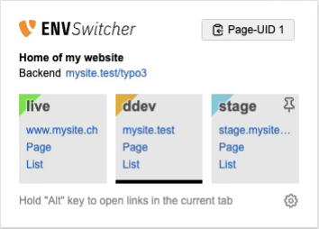
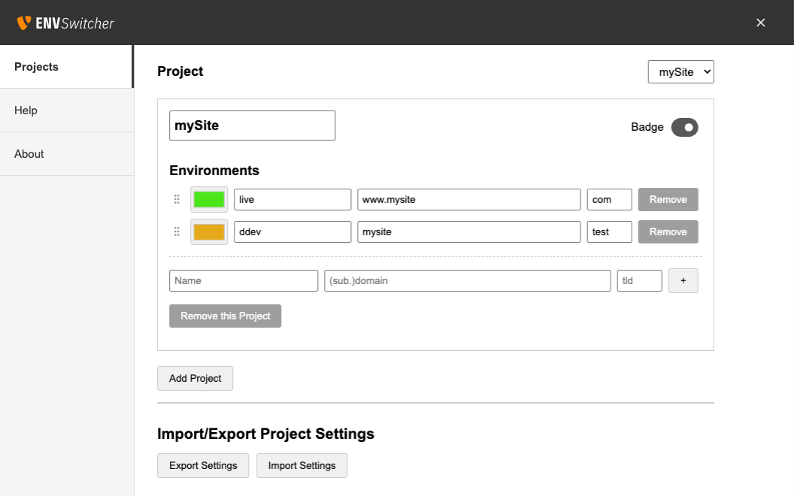

# TYPO3 Environement Switcher

Chrome extension for TYPO3 CMS developers and editors. Streamlines the workflow of switching between multiple environments.

### Using the Extension
Click the extension icon to open the switcher popup. Copy curent page UID.

|                               ||
|-------------------------------|---|
| |Open the page in the frontend or the List/Page module of another environment. Project environments are detected based on the current page's URL.|
| |Click the upper-right corner to pin an environment to the right side of the list.|

|                               |                                                      |
|-------------------------------|------------------------------------------------------|
|  | Add and enable color badges in the project settings. |

---

#### Privacy

This extension does not collect or transmit any personal data. All settings are stored locally in your
browser's sync storage.