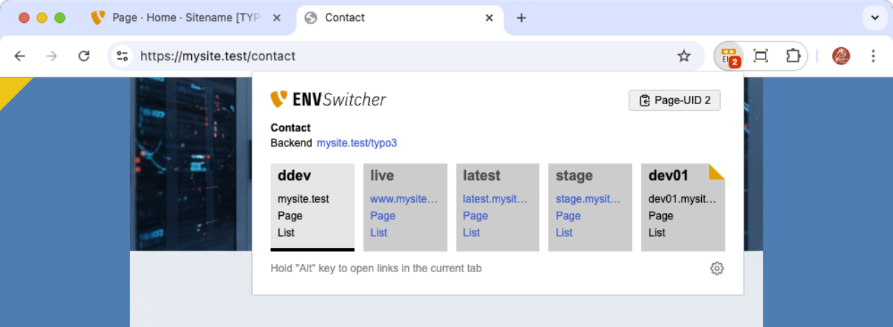
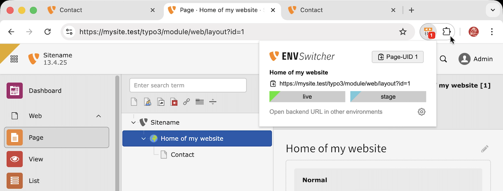

# TYPO3 - ENV Switcher

Chrome extension for TYPO3 CMS developers and editors. Streamlines the workflow of switching between multiple environments.

## ✨ Features

- Project based env configuration
- get UID of current page
- jump to different subdomains
- deeplink to the backend
- overlay color badge
- share config json file

### Requirements

| Version | TYPO3   |
| ------- | ------- |
| 1.x     | ≥ 11.x |

## 📙 Documentation

### How to use

Click the extension icon to open the switcher popup.

#### Frontend

| Symbol                            | Description                                                                      |
| --------------------------------- | -------------------------------------------------------------------------------- |
|    | Copy curent page UID                                                             |
|   | Open the page in the frontend or the List/Page module of another environment     |
|  | Click the upper-right corner to pin an environment to the right side of the list |
|    | Add and enable color badges in the project settings                              |

#### Backend

Call the current backend URL in other environments by clicking the environment links.

### ⚙ Settings

## 🛡 Privacy

This extension does not collect or transmit any personal data. All settings are stored locally in your
browser's sync storage.

## ⚖ Legal

### Licence

This project is licensed under [GNU General Public License v3.0](LICENSE).

### Trademarks

| asset      | source                                                                                                                                    |
| ---------- | ----------------------------------------------------------------------------------------------------------------------------------------- |
| Icons      | [Lucide Icons](https://lucide.dev)                                                                                                        |
| Fonts      | IBM Plex Mono (Google Fonts), Share (TYPO3)                                                                                               |
| TYPO3 Logo | The TYPO3 Association is owner of the TYPO3 trademark and logo.[Brand guidelines](https://typo3.com/typo3-cms/the-brand/brand-guidelines) |

## 🙏🏻 Credits

Partly inspired by [TYPO3 PID Helper](https://chromewebstore.google.com/detail/typo3-pid-helper/epgcolbkhdbpplgndgmbcdnepgdophob) and [TYPO3 - BE/FE/Env Handy Switcher](https://chromewebstore.google.com/detail/typo3-befeenv-handy-switc/ohemimdlihjdeacgbccdkafckackmcmn).
